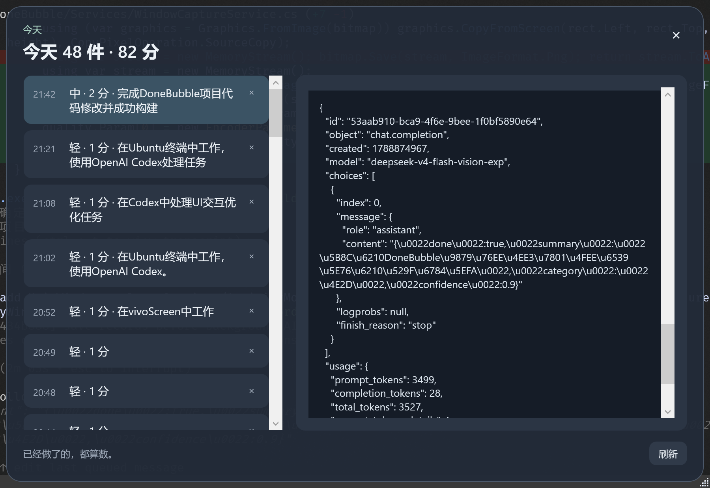

# DoneBubble

DoneBubble 是一个 Windows 桌面极简事务记录工具，只回答一个问题：**今天我已经处理了多少件事情？**

人的精力、注意力和工作记忆都有限。回复一条重要消息、做一次决定、切换到另一个问题，都会重新建立上下文；频繁切换事情，本身就会消耗精力。DoneBubble 记录的是今天已经占用过的注意力和决策负荷，而不是还有多少待办。

它不管理任务、截止时间或项目。想到“这件事处理完了”，点击气泡，选择负荷等级，几秒内完成记录。

## 下载和运行

从 [Releases](https://github.com/frankqwang/DoneBubble/releases) 下载 Windows x64 的 `DoneBubble.exe`，放到固定目录后运行。自包含版本不要求预装 .NET，也不需要 WSL。支持 Windows 10 / 11。

当前发布包未签名，首次运行可能出现 Windows SmartScreen 未知发布者提示；确认来源后即可运行。

## 核心体验

### 快速记录

气泡显示今日件数和负荷分数。展开后直接选择：

- **轻 · 1 分**：普通回复、小操作
- **中 · 2 分**：需要思考或沟通
- **重 · 3 分**：复杂决策、事故、长时间排查

备注可以不填。选择后立即保存并收起，不会被 AI 请求阻塞。每累计 5 分提醒休息，默认倒计时 10 分钟，可按 5 分钟增减。

### 本地 AI 总结（默认开启，可关闭）

用户选择分类后，记录会先保存，AI 在后台总结这一段活动；失败也不会影响记录。

AI 只在本机工作，主要依据：

- 前台应用和窗口标题
- 窗口切换轨迹、有效活动时长
- 可访问文本控件的短摘录
- 每次采样的完整桌面截图

完整截图全部保存在 AI 日志中；发送给视觉模型时选取最多 3 张代表帧，缩放到最长边 1280 像素并压缩，以平衡信息量和速度。应用或主题切换会结束 session；持续至少 3 分钟才尝试自动分析，约 90 秒无操作会清空 session。不会读取全局按键，也不会联网上传。

### 今日记录与 AI 详情

今日记录和 AI 总结是同一个页面：左侧选择记录，右侧查看对应的摘要、截图、提示词和模型原始输出。记录变化会自动刷新，误记录可以直接删除。JSON 输出只做缩进和中文可读化处理。

气泡、分类卡片和休息倒计时置顶；记录页面和调试页面默认不置顶。窗口支持拖动、调整大小和 `Esc` 关闭；关闭窗口只隐藏到托盘，托盘“退出”才会结束程序。

## 界面一览

截图使用诊断测试数据：

| 悬浮气泡与快速分类 | 休息倒计时 |
| --- | --- |
|  |  |



今日页面把记录列表和 AI 证据放在一起，不需要在两个窗口之间切换。

## 本地优先

所有数据保存在 `%LOCALAPPDATA%\\DoneBubble\\`：

```text
donebubble.db       SQLite 事务记录
settings.json       窗口位置、开机启动、AI 配置
ai-sessions.json    AI 摘要、提示词、原始输出和截图
```

不登录、不云同步、不把业务数据写入 exe 目录。托盘只提供显示 / 隐藏、开机启动、退出。开机启动使用当前用户注册表，不需要管理员权限。

默认使用 LM Studio 的 OpenAI 兼容接口：

```text
http://127.0.0.1:1234/v1/chat/completions
```

模型和接口可在 `%LOCALAPPDATA%\\DoneBubble\\settings.json` 中调整。

## 开发和发布

技术栈：C#、.NET 8、WPF、轻量 MVVM、Microsoft.Data.Sqlite、Windows Forms `NotifyIcon`。

```powershell
dotnet build
dotnet run
dotnet publish -c Release -r win-x64 --self-contained true -p:PublishSingleFile=true
```

发布文件：`bin\\Release\\net8.0-windows\\win-x64\\publish\\DoneBubble.exe`。

WSL 可以通过 `dotnet.exe` 调用 Windows SDK 构建，但 WPF 窗口和托盘只能在 Windows 桌面环境运行。

## 当前边界

- 目前只展示今天的记录，历史数据保留在 SQLite。
- 删除记录暂无撤销。
- AI 是辅助总结，不能保证完整还原工作内容，也不会自动替用户记账。
- 截图和可访问文本可能受目标应用权限、窗口类型和隐私保护限制。
- 当前没有安装器、自动更新和代码签名，发布目标为 Windows x64。
