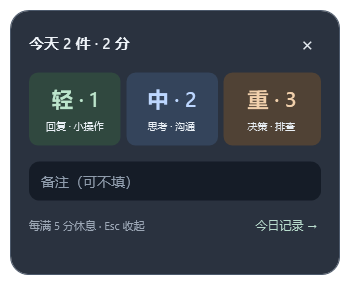

# DoneBubble

Windows 10 / 11 桌面极简事务计数器：记录今天已经处理的事。数据留在本机，无登录、网络请求或遥测。

## 直接体验

从 [最新版本](https://github.com/frankqwang/DoneBubble/releases/latest) 下载 `DoneBubble.exe`，放到固定目录后双击运行。支持 Windows 10 / 11 x64，无需安装 .NET，也无需 WSL。

| 快速记录 | 独立休息倒计时 |
| --- | --- |
|  |  |

界面图使用诊断测试数据。

- 点击气泡 → 点击「轻 / 中 / 重」：无需输入，立即保存、计数 +1、自动收起。
- 轻：普通回复、小操作；中：需要思考 / 沟通；重：复杂决策、事故、长时间排查。
- 备注可不填，也可以先写备注再点分类；备注框内 Enter 仍可保存普通文字记录。轻 / 中 / 重分别计 1 / 2 / 3 分，未分类文字记录按 1 分计。气泡显示件数，展开卡片及历史标题显示今日累计分数。
- 当天累计分数每达到或跨过 5、10、15……分，托盘提醒休息，并显示今日分数。超过门槛的余分保留，例如 4 分加重事项到 7 分会提醒，下次门槛仍是 10 分。同一门槛重启不重复，删除后重新达到已提醒过的门槛也不重复；次日重新计数。系统通知设置或勿扰模式可能隐藏提醒。
- 每次休息提醒自动启动 10 分钟倒计时。独立置顶浮层以 46px 大字显示剩余时间，自动显示时不抢焦点；浮层里的 − / + 每次减少 / 增加 5 分钟。拖动标题或时间可移动浮层，位置会保存；气泡只显示件数。浮层随托盘隐藏，到期自动收起；Alt+F4 可单独隐藏，点击托盘可恢复，减到 0 结束本次休息。倒计时期间再次达到门槛不会重置时间。到期以托盘通知提醒一次。结束时间保存在设置中，重启继续、电脑休眠期间也计时。
- 气泡移除了固定浅色描边，使用低饱和度负载色：每 5 分从灰绿经柔和琥珀过渡至豆沙红，5/10/15 分保持周期红色，下一分开启新周期。累计分数越高，每轮起始色越暖、整体越深；颜色变化有上限以保证数字清晰。删除和跨日刷新会重新计算颜色，悬停显示今日分数。
- 拖动气泡调整位置；Esc 或点击外部收起，未提交内容保留在当前进程中。
- 展开卡片中的「今日记录」显示倒序列表；× 直接删除误记录。
- 托盘菜单：显示 / 隐藏、今日记录、开机启动、退出。左键托盘显示气泡。
- 可选「AI 活动识别（本地）」：只观察前台应用、窗口标题、当前可访问文本控件的短摘录、程序路径和有效活动时长，向本机 LM Studio 请求候选摘要；候选必须手动确认才会计入。默认关闭，LM Studio 未运行时静默跳过。
- 托盘中的「AI 调试窗口」可以主动采集当前上下文并调用模型，分别查看采集内容、完整提示词、原始 HTTP 输出和解析后的候选，方便调整模型与提示词。
- 卡片 × 只收起卡片并保留气泡；Alt+F4 隐藏到托盘；关闭历史窗口只关闭历史视图。真正退出用托盘「退出」。
- 开机启动默认关闭，用户在托盘中勾选后启用，无需管理员权限。启用前请将 exe 放在长期保留的位置；移动后重新勾选。

## 开发与发布

Windows 安装 .NET 8 SDK 或兼容的较新 SDK，在本目录执行：

```powershell
dotnet build
dotnet run
```

发布单文件、自包含 Windows x64 版本：

```powershell
dotnet publish -c Release -r win-x64 --self-contained true -p:PublishSingleFile=true
```

输出：`bin\Release\net8.0-windows\win-x64\publish\DoneBubble.exe`。

也可执行 `dotnet publish -p:PublishProfile=Windows`。WPF 不启用裁剪。原生依赖纳入单文件，运行时由 .NET 解包到用户临时目录；这不影响业务数据保存位置。参见 [微软单文件部署说明](https://learn.microsoft.com/en-us/dotnet/core/deploying/single-file/overview)。

WSL 可通过 `dotnet.exe` 执行同样命令，使用宿主 Windows SDK。

## 结构与技术决策

```text
DoneBubble/
├── App.xaml / App.xaml.cs           生命周期、单实例、托盘
├── MainWindow.xaml / .xaml.cs       气泡、拖动、焦点、中文输入、屏幕修正
├── RestWindow.xaml / .xaml.cs       独立大字休息倒计时
├── HistoryWindow.xaml / .xaml.cs    今日历史
├── Models/RecordItem.cs
├── ViewModels/MainViewModel.cs      输入、记录、计数、错误状态
├── Services/
│   ├── DatabaseService.cs           SQLite 初始化、参数化读写
│   ├── SettingsService.cs           JSON 原子替换
│   └── StartupService.cs            当前用户 Run 注册表
├── Properties/PublishProfiles/Windows.pubxml
├── SelfTest.cs                      隔离数据库与窗口冒烟测试
└── scripts/Verify.ps1
```

.NET 8 + WPF，轻量 MVVM。唯一直接 NuGet 依赖为 Microsoft.Data.Sqlite 8.0.24；托盘使用 .NET 自带 Windows Forms NotifyIcon。原生屏幕工作区与窗口坐标处理避免把像素与 WPF DIP 混用。

数据位于 `%LOCALAPPDATA%\DoneBubble\`：

- `donebubble.db`：Records(Id, Content, CreatedAt, Category)，旧数据库自动添加可空 Category 列，保留原有记录，自动建表及时间索引。
- `settings.json`：windowX、windowY、autoStart、aiAssistEnabled、aiEndpoint、aiModel。

CreatedAt 保存记录时本地时间；当天查询用半开日期范围，以利用索引。每秒检查日期变化；展开或查看历史时立即刷新。跨时区后旧记录仍归属于原先记录的本地日期。计数由成功读出的今日记录计算；数据库失败显示「—」而非误报 0，保存失败保留输入。

## 验证

发布后，在 Windows PowerShell 中执行：

```powershell
powershell -ExecutionPolicy Bypass -File .\scripts\Verify.ps1
```

诊断使用独立临时目录，不读写用户记录与开机启动注册表。覆盖初始化、日期边界、排序、SQL 参数、删除、空输入、计数、失败保留草稿、设置持久化、窗口加载、Enter 保存收起与关闭隐藏。结果写入 `verification.txt`，另输出实际 WPF 渲染图。

已在 Windows 上使用 .NET SDK 9.0.311 构建 net8.0-windows，并实际运行自包含发布包完成验证。验证结果由脚本在本地生成。

仍需人工在目标桌面验证：中文输入法候选确认、跨不同缩放比例显示器拖动、插拔显示器、托盘操作，以及真实登录后的开机启动。

## MVP 限制

- 仅 Windows，当前发布目标 x64；未签名、无安装器和自动更新。
- 仅显示今天的历史，过往记录保留在 SQLite；暂无历史日期浏览、编辑或导出。
- 删除立即生效，暂无撤销；输入上限 2000 字符。
- 草稿仅保留在内存中；退出前未提交的内容不会落盘。
- AI 识别是启发式候选：连续有效活动约 10 分钟后，在切换工作主题时请求判断；只发送应用上下文和脱敏后的可访问文本短摘录，不读取全局按键、截图、剪贴板或密码框。默认关闭，可在托盘打开「AI 活动识别（本地）」。LM Studio 默认接口为 `http://127.0.0.1:1234/v1/chat/completions`；模型名按 LM Studio 当前加载模型的 ID 修改 `settings.json`。
- 当前已针对 LM Studio 的 `qwen3.5-4b` 配置默认模型名；若 LM Studio 显示的模型 ID 不同，修改 `%LOCALAPPDATA%\DoneBubble\settings.json` 中的 `aiModel`。调试窗口的主动分析不受「AI 活动识别」开关影响，但不会自动入账。
- SQLite 本地操作设置 2 秒锁等待；遇到磁盘或锁异常显示可重试错误。
- 开机启动状态以注册表为准，并同步到设置文件；Windows 启动应用管理中的额外禁用仍由系统控制。
